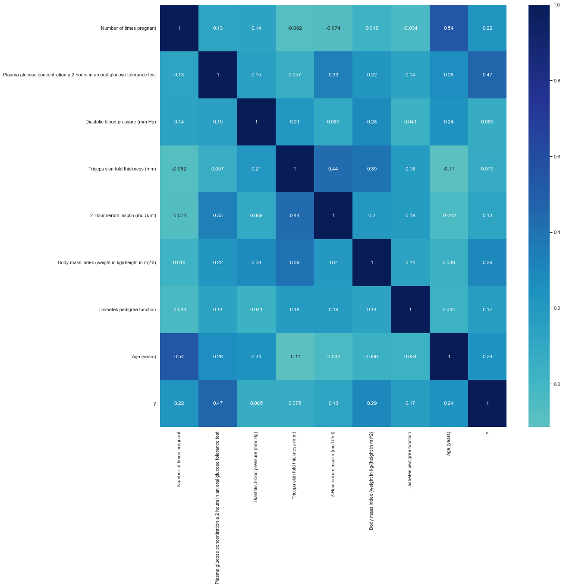
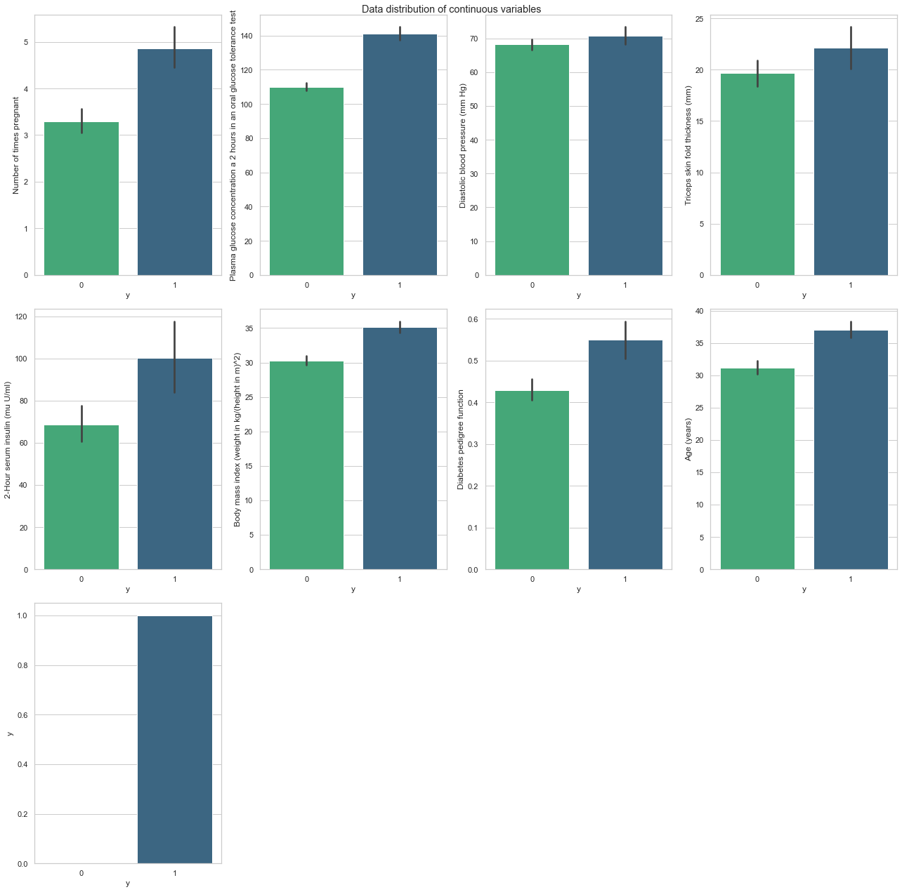
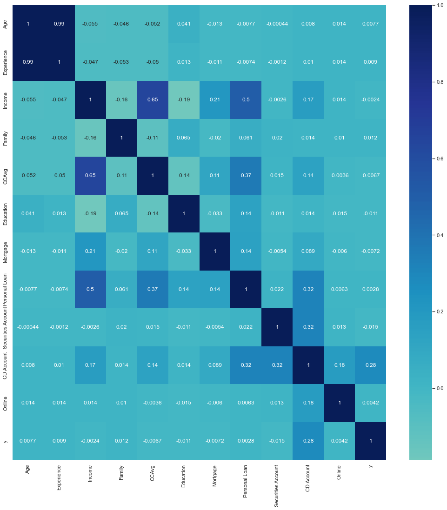
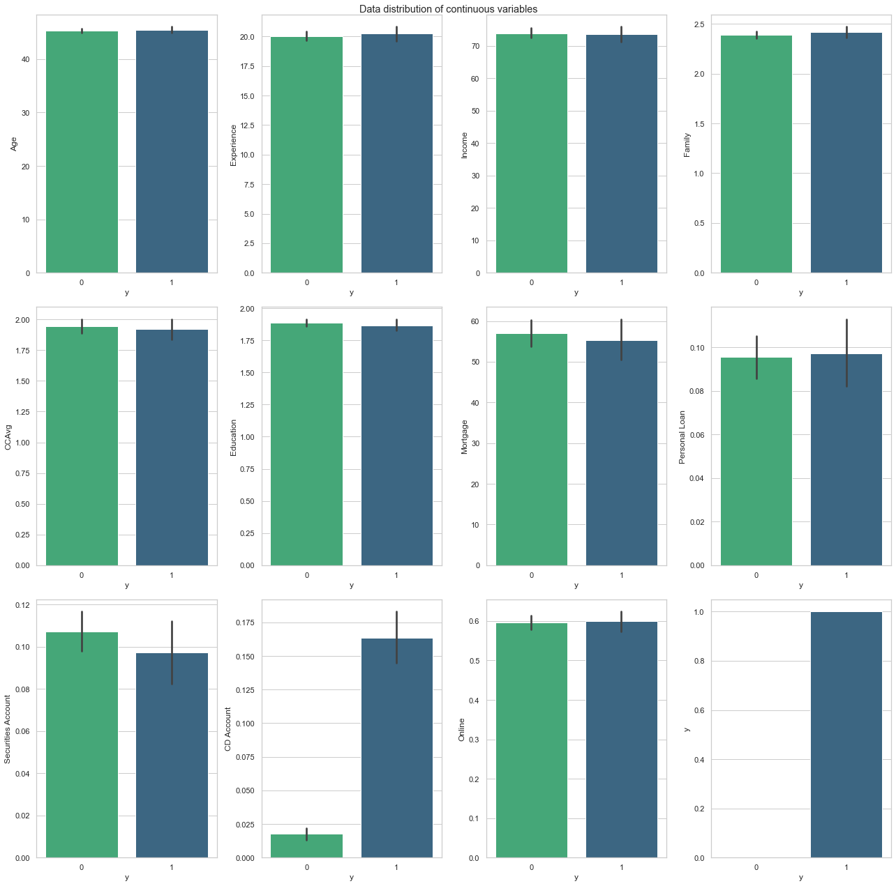
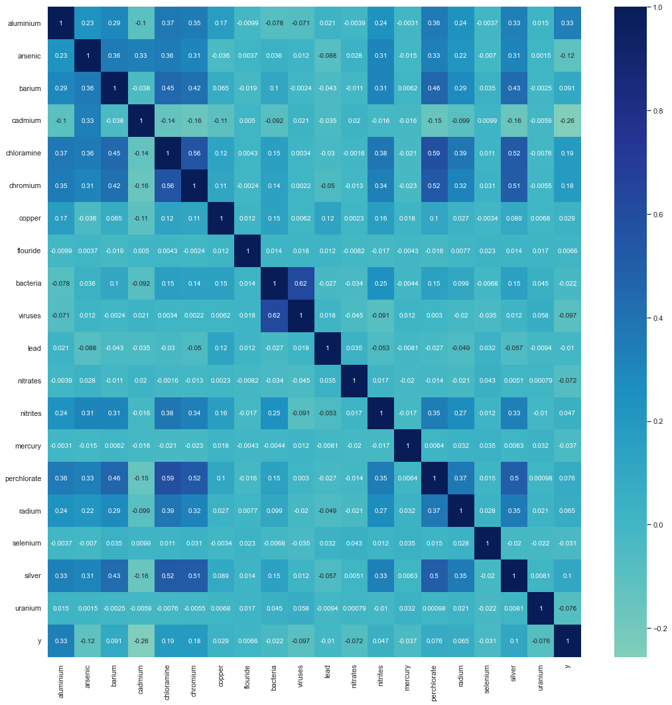
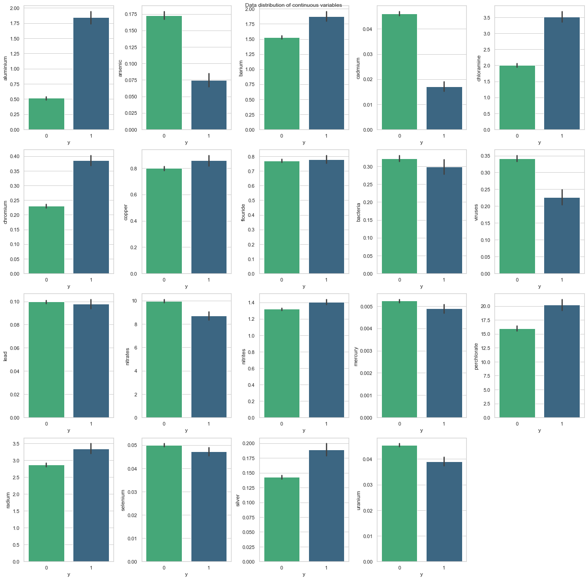
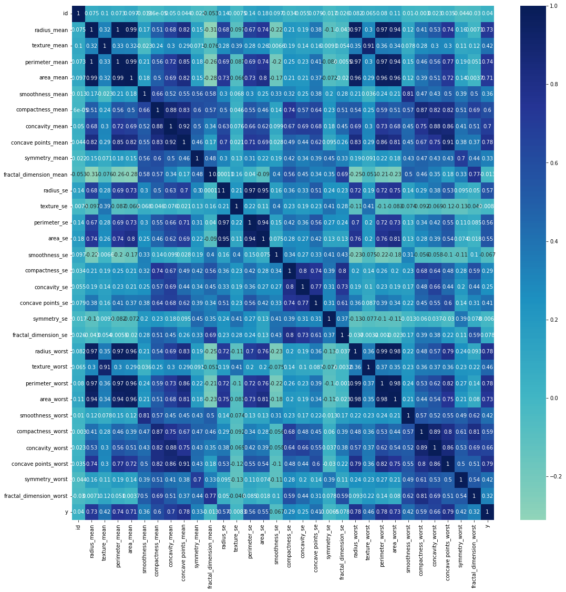
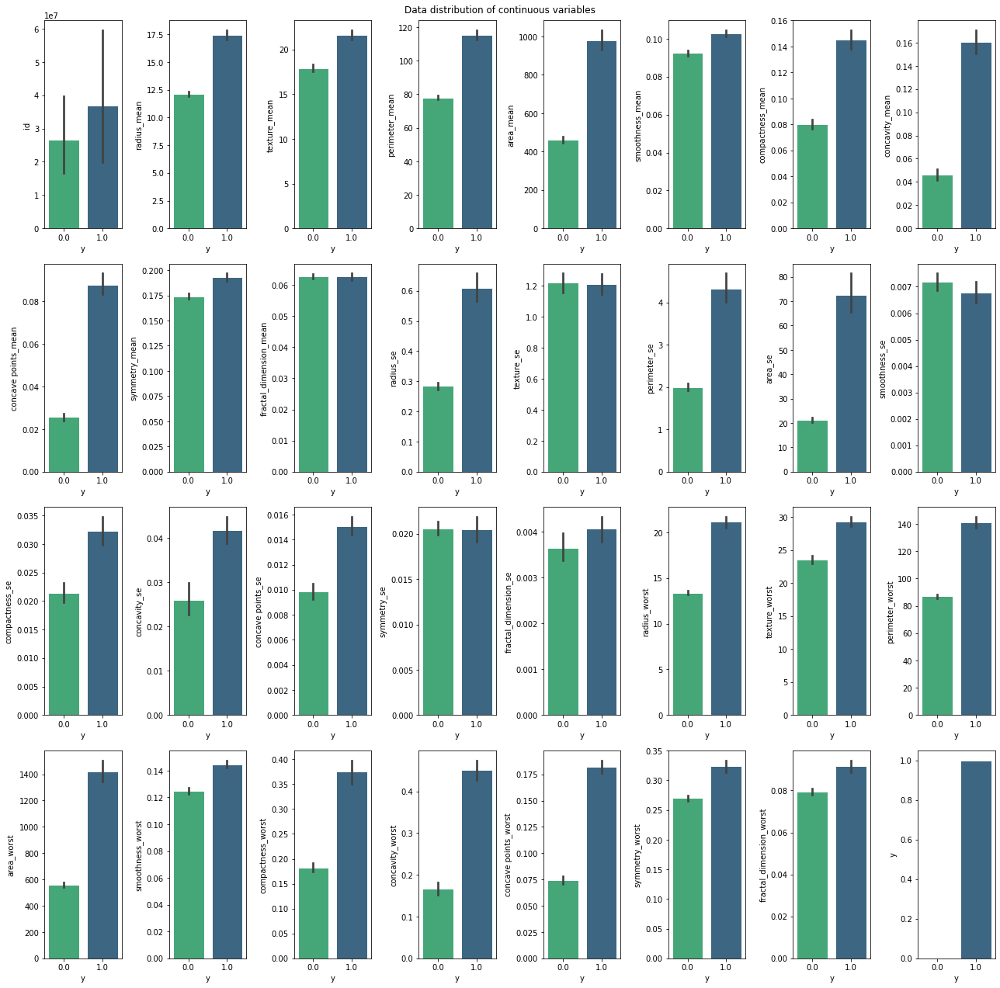

# Business-Analytics_4
## # Boosting #Decision Tree # AdaBoost #GBM #XGBoost #LightGBM
## Tutorial Purposes
1. Apply boosting algorithms w/ and w/o sklearn to four real-world datasets which has different number of variables.

2. Apply gridsearch to each algorithms for finding best hyperparameters.

3. Derive and compare the importance of variables by algorithm.

4. Compare the classification performance among boosting algorithms. 

## Datasets

### Diabetes Binary Classification 

Data Link: https://www.kaggle.com/datasets/girishvutukuri/diabetes-binary-classification

Dataset with 768 rows and 9 columns




---

### Universal Bank Dataset
Data Link: https://www.kaggle.com/datasets/lowecoryr/universalbank

Dataset with 5000 rows and 14 columns




---
### Water Quality Dataset
Data Link: https://www.kaggle.com/datasets/mssmartypants/water-quality/code

Dataset with 7999 rows and 21 columns



---
### Breast Cancer Dataset

Data Link: https://www.kaggle.com/datasets/yasserh/breast-cancer-dataset

Dataset with 569 rows and 32 columns




---

The size of each dataset is below.


| data   | rows | columns |
|--------|------|---------|
| data_1 | 768  | 9       |
| data_2 | 5000 | 14      |
| data_3 | 7999 | 21      |
| data_4 | 569  | 32      |

## 0. Decision Tree (Baseline)

**Grid Search For Best Hyperparameters of Decision Tree**
```
import numpy as np
import pandas as pd
from sklearn.metrics import confusion_matrix, accuracy_score, precision_score, recall_score, f1_score
from sklearn.tree import DecisionTreeClassifier
from sklearn.model_selection import GridSearchCV
from sklearn.model_selection import train_test_split
import datetime
import math

# Decision Tree
def run_decision_tree():
    names = ['data_1','data_2','data_3','data_4']
    acc_lst = []
    p_lst = []
    r_lst = []
    f_lst = []
    time_lst = []
    
    for name in names:
        data = pd.read_csv(f'./data/{name}.csv'.format(name))
            
        X = data.iloc[:, :-1]
        y = data.iloc[:, -1]
        
        model = DecisionTreeClassifier()

        X_train, X_test, y_train, y_test = train_test_split(X, y, test_size=0.2, random_state=5)
        
        param_grid = {'max_depth': [i for i in range(1,20,3)],
                      'min_samples_split': [i for i in range(2,10,2)]}

        grid_search = GridSearchCV(model,param_grid,scoring="accuracy", refit=True,cv=10, return_train_score=True)

        grid_search.fit(X_train, y_train)
        
        best_params = grid_search.best_params_
        print(f"Best params: {best_params}")
        
        import time 
        start = time.time()
        math.factorial(1234567)
        if_clf = DecisionTreeClassifier(**best_params)
        if_clf.fit(X_train, y_train)

        y_pred = if_clf.predict(X_test)

        acc = accuracy_score(y_pred, y_test)
        p = precision_score(y_pred, y_test)
        r = recall_score(y_pred, y_test)
        f = f1_score(y_pred, y_test)
        
        end = time.time()
        sec = (end - start)
        time = str(datetime.timedelta(seconds=sec)).split(".")[0]
        
        acc_lst.append(acc)
        p_lst.append(p)
        r_lst.append(r)
        f_lst.append(f)
        time_lst.append(time)
            
    result = pd.DataFrame({'data':names, 'accuracy': acc_lst,
                                'precision_score': p_lst, 'recall_score': r_lst, 'f1_score': f_lst, 'time':time_lst})
    result.to_csv('./results/decision_tree.csv',index=False)
    
run_decision_tree()
```
### 0. Decision Tree (Baseline) Result

The result table of the decision tree algorithm and the best hyperparameters for each dataset are below. Interestingly, as the variables of the data increase, the optimal max_depth value increases. Data_1 has 9 columns and the optimal max_depth is 1, and data_4 has 32 columns and the optimal max_depth is 19. Unlike max_depth, min_samples_split is not related to the number of variables. The optimal min_samples_split is 8 only at data_3, which has the largest number of samples. With this result, we can find out that min_samples_split is related to the number of samples.

**0. Decision Tree (Baseline) Best Hyperparameters**

| data   | max_depth | min_samples_split |
|--------|-----------|-------------------|
| data_1 | 1         | 2                 |
| data_2 | 4         | 2                 |
| data_3 | 16        | 8                 |
| data_4 | 19        | 2                 |


**0. Decision Tree (Baseline)**

| data   | accuracy           | precision_score     | recall_score       | f1_score            | time    |
|--------|--------------------|---------------------|--------------------|---------------------|---------|
| data_1 | 0.7597402597402597 | 0.42592592592592593 | 0.7931034482758621 | 0.5542168674698795  | 0:00:11 |
| data_2 | 0.748              | 0.14035087719298245 | 0.851063829787234  | 0.24096385542168675 | 0:00:10 |
| data_3 | 0.953125           | 0.7900552486187845  | 0.7944444444444444 | 0.7922437673130193  | 0:00:10 |
| data_4 | 0.956140350877193  | 0.9375              | 0.9574468085106383 | 0.9473684210526315  | 0:00:11 |

According to the table, data_4 has the highest accuracy, precision score, recall score, and f1 score. We would consider this result as out baseline for comparing with the performance of boosting algorithms.

## 1. AdaBoost

### 1-1. AdaBoost From Scratch
**Decision stump used as weak classifier**
```
class DecisionStump:
    def __init__(self):
        self.polarity = 1
        self.feature_idx = None
        self.threshold = None
        self.alpha = None

    def predict(self, X):
        n_samples = X.shape[0]
        X_column = X.iloc[:, self.feature_idx]
        predictions = np.ones(n_samples)
        if self.polarity == 1:
            predictions[X_column < self.threshold] = -1
        else:
            predictions[X_column > self.threshold] = -1

        return predictions
```

**AdaBoost Class**
```
class Adaboost:
    def __init__(self, n_clf=5):
        self.n_clf = n_clf
        self.clfs = []

    def fit(self, X, y):
        n_samples, n_features = X.shape

        # Initialize weights to 1/N
        w = np.full(n_samples, (1 / n_samples))

        self.clfs = []

        # Iterate through classifiers
        for _ in range(self.n_clf):
            clf = DecisionStump()
            min_error = float("inf")

            # greedy search to find best threshold and feature
            for feature_i in range(n_features):
                X_column = X.iloc[:, feature_i]
                thresholds = np.unique(X_column)

                for threshold in thresholds:
                    # predict with polarity 1
                    p = 1
                    predictions = np.ones(n_samples)
                    predictions[X_column < threshold] = -1

                    # Error = sum of weights of misclassified samples
                    misclassified = w[y != predictions]
                    error = sum(misclassified)

                    if error > 0.5:
                        error = 1 - error
                        p = -1

                    # store the best configuration
                    if error < min_error:
                        clf.polarity = p
                        clf.threshold = threshold
                        clf.feature_idx = feature_i
                        min_error = error

            # calculate alpha
            EPS = 1e-10
            clf.alpha = 0.5 * np.log((1.0 - min_error + EPS) / (min_error + EPS))

            # calculate predictions and update weights
            predictions = clf.predict(X)

            w *= np.exp(-clf.alpha * y * predictions)
            # Normalize to one
            w /= np.sum(w)

            # Save classifier
            self.clfs.append(clf)

    def predict(self, X):
        clf_preds = [clf.alpha * clf.predict(X) for clf in self.clfs]
        y_pred = np.sum(clf_preds, axis=0)
        y_pred = np.sign(y_pred)

        return y_pred
```

**Run AdaBoost**
```
from sklearn.model_selection import train_test_split
import datetime
import math

# AdaBoost -1 
def run_adaboost_1():

    names = ['data_1','data_2','data_3','data_4']
    weaks = [i for i in range(5,40,5)]
    
    name_lst = []
    weak_lst = []
    acc_lst = []
    p_lst = []
    r_lst = []
    f_lst = []
    time_lst = []
    
    for name in names:
        for weak in weaks:
            data = pd.read_csv(f'./data/{name}.csv'.format(name))
            
            X = data.iloc[:, :-1]
            y = data.iloc[:, -1]
            y[y == 0] = -1

            X_train, X_test, y_train, y_test = train_test_split(X, y, test_size=0.2, random_state=5)
            import time
            start = time.time()

            # Adaboost classification with 5 weak classifiers
            clf = Adaboost(n_clf=weak)
            clf.fit(X_train, y_train)
            y_pred = clf.predict(X_test)
            
            acc = accuracy_score(y_pred, y_test)
            p = precision_score(y_pred, y_test)
            r = recall_score(y_pred, y_test)
            f = f1_score(y_pred, y_test)
            
            sec = (time.time()- start)
            
            time = str(datetime.timedelta(seconds=sec)).split(".")[0]

            acc_lst.append(acc)
            p_lst.append(p)
            r_lst.append(r)
            f_lst.append(f)
            name_lst.append(name)
            weak_lst.append(weak)
            time_lst.append(time)
            
    result = pd.DataFrame({'data':names, '# of weak models':weak_lst, 'accuracy': acc_lst,
                                'precision_score': p_lst, 'recall_score': r_lst, 'f1_score': f_lst, 'time': time_lst})
    result.to_csv('./results/adaboost_1.csv',index=False)
    
run_adaboost_1()
```

### 1-2. AdaBoost With Sklearn (GridSearch)
```
from sklearn.ensemble import AdaBoostClassifier
from sklearn.model_selection import GridSearchCV
def run_adaboost_2():
    names = ['data_1','data_2','data_3','data_4']
    acc_lst = []
    p_lst = []
    r_lst = []
    f_lst = []
    time_lst = []
    
    for name in names:
        data = pd.read_csv(f'./data/{name}.csv'.format(name))
            
        X = data.iloc[:, :-1]
        y = data.iloc[:, -1]
        
        model = AdaBoostClassifier()

        X_train, X_test, y_train, y_test = train_test_split(X, y, test_size=0.2, random_state=5)
        
        param_grid = {'n_estimators': [i for i in range(5,40,5)], 
                    'learning_rate': [0.1, 0.3, 0.5, 0.7, 1]}


        grid_search = GridSearchCV(model,param_grid,scoring="accuracy", refit=True,cv=10, return_train_score=True)

        grid_search.fit(X_train, y_train)
        
        best_params = grid_search.best_params_
        print(f"Best params: {best_params}")
        
        import time 
        start = time.time()
        math.factorial(1234567)
        if_clf = AdaBoostClassifier(**best_params)
        if_clf.fit(X_train, y_train)

        y_pred = if_clf.predict(X_test)

        acc = accuracy_score(y_pred, y_test)
        p = precision_score(y_pred, y_test)
        r = recall_score(y_pred, y_test)
        f = f1_score(y_pred, y_test)
        
        end = time.time()
        sec = (end - start)
        time = str(datetime.timedelta(seconds=sec)).split(".")[0]
        
        acc_lst.append(acc)
        p_lst.append(p)
        r_lst.append(r)
        f_lst.append(f)
        time_lst.append(time)
            
    result = pd.DataFrame({'data':names, 'accuracy': acc_lst,
                                'precision_score': p_lst, 'recall_score': r_lst, 'f1_score': f_lst, 'time':time_lst})
    result.to_csv('./results/adaboost_2.csv',index=False)
    
run_adaboost_2()
```

### 1-3. AdaBoost Result

**1-1. AdaBoost From Scratch**

The performance of scratch AdaBoost according to the change of the number of weak models is as follows.

| data   | # of weak models | accuracy           | precision_score     | recall_score       | f1_score            | time    |
|--------|------------------|--------------------|---------------------|--------------------|---------------------|---------|
| data_1 | 5                | 0.8311688311688312 | 0.7037037037037037  | 0.7916666666666666 | 0.7450980392156864  | 0:00:01 |
| data_1 | 10               | 0.7987012987012987 | 0.6111111111111112  | 0.7674418604651163 | 0.6804123711340206  | 0:00:03 |
| data_1 | 15               | 0.8181818181818182 | 0.7037037037037037  | 0.76               | 0.7307692307692308  | 0:00:05 |
| data_1 | 20               | 0.8051948051948052 | 0.6851851851851852  | 0.74               | 0.7115384615384615  | 0:00:07 |
| data_1 | 25               | 0.8181818181818182 | 0.7037037037037037  | 0.76               | 0.7307692307692308  | 0:00:09 |
| data_1 | 30               | 0.8246753246753247 | 0.7037037037037037  | 0.7755102040816326 | 0.7378640776699029  | 0:00:11 |
| data_1 | 35               | 0.8181818181818182 | 0.6851851851851852  | 0.7708333333333334 | 0.7254901960784315  | 0:00:13 |
| data_2 | 5                | 0.748              | 0.15087719298245614 | 0.8113207547169812 | 0.25443786982248523 | 0:00:01 |
| data_2 | 10               | 0.748              | 0.1543859649122807  | 0.8                | 0.2588235294117647  | 0:00:03 |
| data_2 | 15               | 0.748              | 0.15087719298245614 | 0.8113207547169812 | 0.25443786982248523 | 0:00:04 |
| data_2 | 20               | 0.748              | 0.15789473684210525 | 0.7894736842105263 | 0.2631578947368421  | 0:00:06 |
| data_2 | 25               | 0.748              | 0.15087719298245614 | 0.8113207547169812 | 0.25443786982248523 | 0:00:07 |
| data_2 | 30               | 0.748              | 0.15789473684210525 | 0.7894736842105263 | 0.2631578947368421  | 0:00:09 |
| data_2 | 35               | 0.748              | 0.15087719298245614 | 0.8113207547169812 | 0.25443786982248523 | 0:00:11 |
| data_3 | 5                | 0.87875            | 0.16574585635359115 | 0.410958904109589  | 0.23622047244094488 | 0:00:28 |
| data_3 | 10               | 0.8925             | 0.44751381215469616 | 0.5294117647058824 | 0.4850299401197605  | 0:00:56 |
| data_3 | 15               | 0.899375           | 0.47513812154696133 | 0.5657894736842105 | 0.5165165165165165  | 0:01:24 |
| data_3 | 20               | 0.895625           | 0.44751381215469616 | 0.5472972972972973 | 0.49240121580547114 | 0:01:52 |
| data_3 | 25               | 0.890625           | 0.35911602209944754 | 0.5241935483870968 | 0.4262295081967213  | 0:02:21 |
| data_3 | 30               | 0.895              | 0.430939226519337   | 0.5454545454545454 | 0.4814814814814815  | 0:02:49 |
| data_3 | 35               | 0.890625           | 0.35911602209944754 | 0.5241935483870968 | 0.4262295081967213  | 0:03:18 |
| data_4 | 5                | 0.9649122807017544 | 0.9166666666666666  | 1.0                | 0.9565217391304348  | 0:00:21 |
| data_4 | 10               | 0.9649122807017544 | 0.9166666666666666  | 1.0                | 0.9565217391304348  | 0:00:44 |
| data_4 | 15               | 0.9736842105263158 | 0.9375              | 1.0                | 0.967741935483871   | 0:01:06 |
| data_4 | 20               | 0.9736842105263158 | 0.9375              | 1.0                | 0.967741935483871   | 0:01:29 |
| data_4 | 25               | 0.9736842105263158 | 0.9375              | 1.0                | 0.967741935483871   | 0:01:51 |
| data_4 | 30               | 0.9649122807017544 | 0.9166666666666666  | 1.0                | 0.9565217391304348  | 0:02:14 |
| data_4 | 35               | 0.9736842105263158 | 0.9375              | 1.0                | 0.967741935483871   | 0:02:37 |

Through the experimental result above, we can figure out three facts.

1. As the number of weak model increases, the model execution time increases.
2. In data_2, the number of weak model does not affect to the classification performance.
3. Just because the number of weak model is large does not necessarily mean that it is good.


**1-2. AdaBoost With Sklearn (GridSearch) Best Hyperparameters**

The best hyperparameters for each dataset are below.

| data   | learning_rate | n_estimators |
|--------|---------------|--------------|
| data_1 | 0.1           | 30           |
| data_2 | 1             | 10           |
| data_3 | 0.7           | 35           |
| data_4 | 0.7           | 20           |

Since data_1 is the smallest, the optimal learning rate is the lowest. As the size of the dataset increases, the learning rate does not have to be small. However, the number of estimators is not related to either the number of variables or the number of samples.


**1-2. AdaBoost With Sklearn (GridSearch)**


| data   | accuracy           | precision_score     | recall_score       | f1_score            | time    |
|--------|--------------------|---------------------|--------------------|---------------------|---------|
| data_1 | 0.8051948051948052 | 0.5740740740740741  | 0.8157894736842105 | 0.6739130434782609  | 0:00:09 |
| data_2 | 0.748              | 0.15087719298245614 | 0.8113207547169812 | 0.25443786982248523 | 0:00:08 |
| data_3 | 0.928125           | 0.4861878453038674  | 0.8                | 0.604810996563574   | 0:00:09 |
| data_4 | 0.9649122807017544 | 0.9166666666666666  | 1.0                | 0.9565217391304348  | 0:00:08 |

Through the experimental result above, we can figure out three facts.

1. The performance of scratch AdaBoost and sklearn AdaBoost is the same at data_2. 
2. Scratch AdaBoost's classification ability is better than package AdaBoost at other datasets. 
3. However, package AdaBoost takes less time than scratch code. 

## 2. GBM (Gradient Boosting Machine)
### 2-1. GBM From Scratch 
```
class GradientBoostingFromScratch():
    
    def __init__(self, n_trees, learning_rate, max_depth=1):
        self.n_trees=n_trees; self.learning_rate=learning_rate; self.max_depth=max_depth;
        
    def fit(self, x, y):
        self.trees = []
        self.F0 = y.mean()
        Fm = self.F0 
        for _ in range(self.n_trees):
            tree = DecisionTreeClassifier(max_depth=self.max_depth)
            tree.fit(x, y)
            Fm += self.learning_rate * tree.predict(x)
            self.trees.append(tree)
            
    def predict(self, x):
        return self.F0 + self.learning_rate * np.sum([tree.predict(x) for tree in self.trees], axis=0)
```

### 2-2. GBM With Sklearn (GridSearch)
```
def run_gbm_2():
    names = ['data_1','data_2','data_3','data_4']
    acc_lst = []
    p_lst = []
    r_lst = []
    f_lst = []
    time_lst = []
    
    for name in names:
        data = pd.read_csv(f'./data/{name}.csv'.format(name))
            
        X = data.iloc[:, :-1]
        y = data.iloc[:, -1]
        
        model = GradientBoostingClassifier()

        X_train, X_test, y_train, y_test = train_test_split(X, y, test_size=0.2, random_state=5)
        
        param_grid = {'n_estimators': [i for i in range(100,300,50)], 
                    'learning_rate': [0.1, 0.3, 0.5, 0.7, 1],
                    'min_samples_split': [i for i in range(2,10,2)],
                    'max_depth': [i for i in range(3,30,5)],
                    'loss': ['log_loss','deviance','exponential']}


        grid_search = GridSearchCV(model,param_grid,scoring="accuracy", refit=True,cv=10, return_train_score=True)

        grid_search.fit(X_train, y_train)
        
        best_params = grid_search.best_params_
        print(f"Best params: {best_params}")
        
        import time 
        start = time.time()
        math.factorial(1234567)
        if_clf = GradientBoostingClassifier(**best_params)
        if_clf.fit(X_train, y_train)

        y_pred = if_clf.predict(X_test)

        acc = accuracy_score(y_pred, y_test)
        p = precision_score(y_pred, y_test)
        r = recall_score(y_pred, y_test)
        f = f1_score(y_pred, y_test)
        
        end = time.time()
        sec = (end - start)
        time = str(datetime.timedelta(seconds=sec)).split(".")[0]
        
        acc_lst.append(acc)
        p_lst.append(p)
        r_lst.append(r)
        f_lst.append(f)
        time_lst.append(time)
            
    result = pd.DataFrame({'data':names, 'accuracy': acc_lst,
                                'precision_score': p_lst, 'recall_score': r_lst, 'f1_score': f_lst, 'time':time_lst})
    result.to_csv('./results/gbm_2.csv',index=False)
    
run_gbm_2()
```


### 2-3. GBM Result
The performance of scratch GBM according to the change of the number of weak models is as follows.

**2-1. GBM From Scratch**
| data   | # of weak models | accuracy           | precision_score     | recall_score       | f1_score            | time    |
|--------|------------------|--------------------|---------------------|--------------------|---------------------|---------|
| data_1 | 5                | 0.7597402597402597 | 0.42592592592592593 | 0.7931034482758621 | 0.5542168674698795  | 0:00:00 |
| data_1 | 10               | 0.7597402597402597 | 0.42592592592592593 | 0.7931034482758621 | 0.5542168674698795  | 0:00:00 |
| data_1 | 15               | 0.7597402597402597 | 0.42592592592592593 | 0.7931034482758621 | 0.5542168674698795  | 0:00:00 |
| data_1 | 20               | 0.7597402597402597 | 0.42592592592592593 | 0.7931034482758621 | 0.5542168674698795  | 0:00:00 |
| data_1 | 25               | 0.7597402597402597 | 0.42592592592592593 | 0.7931034482758621 | 0.5542168674698795  | 0:00:00 |
| data_1 | 30               | 0.7597402597402597 | 0.42592592592592593 | 0.7931034482758621 | 0.5542168674698795  | 0:00:00 |
| data_1 | 35               | 0.7597402597402597 | 0.42592592592592593 | 0.7931034482758621 | 0.5542168674698795  | 0:00:00 |
| data_2 | 5                | 0.748              | 0.15087719298245614 | 0.8113207547169812 | 0.25443786982248523 | 0:00:00 |
| data_2 | 10               | 0.748              | 0.15087719298245614 | 0.8113207547169812 | 0.25443786982248523 | 0:00:00 |
| data_2 | 15               | 0.748              | 0.15087719298245614 | 0.8113207547169812 | 0.25443786982248523 | 0:00:00 |
| data_2 | 20               | 0.748              | 0.15087719298245614 | 0.8113207547169812 | 0.25443786982248523 | 0:00:00 |
| data_2 | 25               | 0.748              | 0.15087719298245614 | 0.8113207547169812 | 0.25443786982248523 | 0:00:00 |
| data_2 | 30               | 0.748              | 0.15087719298245614 | 0.8113207547169812 | 0.25443786982248523 | 0:00:00 |
| data_2 | 35               | 0.748              | 0.15087719298245614 | 0.8113207547169812 | 0.25443786982248523 | 0:00:00 |
| data_3 | 5                | 0.886875           | 0.0                 | 0.0                | 0.0                 | 0:00:00 |
| data_3 | 10               | 0.886875           | 0.0                 | 0.0                | 0.0                 | 0:00:00 |
| data_3 | 15               | 0.886875           | 0.0                 | 0.0                | 0.0                 | 0:00:00 |
| data_3 | 20               | 0.886875           | 0.0                 | 0.0                | 0.0                 | 0:00:00 |
| data_3 | 25               | 0.886875           | 0.0                 | 0.0                | 0.0                 | 0:00:00 |
| data_3 | 30               | 0.886875           | 0.0                 | 0.0                | 0.0                 | 0:00:00 |
| data_3 | 35               | 0.886875           | 0.0                 | 0.0                | 0.0                 | 0:00:00 |
| data_4 | 5                | 0.9122807017543859 | 0.8125              | 0.975              | 0.8863636363636362  | 0:00:00 |
| data_4 | 10               | 0.9122807017543859 | 0.8125              | 0.975              | 0.8863636363636362  | 0:00:00 |
| data_4 | 15               | 0.9122807017543859 | 0.8125              | 0.975              | 0.8863636363636362  | 0:00:00 |
| data_4 | 20               | 0.9122807017543859 | 0.8125              | 0.975              | 0.8863636363636362  | 0:00:00 |
| data_4 | 25               | 0.9122807017543859 | 0.8125              | 0.975              | 0.8863636363636362  | 0:00:00 |
| data_4 | 30               | 0.9122807017543859 | 0.8125              | 0.975              | 0.8863636363636362  | 0:00:00 |
| data_4 | 35               | 0.9122807017543859 | 0.8125              | 0.975              | 0.8863636363636362  | 0:00:00 |

Through the experimental result above, we can figure out three facts.

1. The number of the weak models is not related to the classification performance of every dataset.
2. data_4 > data_3 > data_1 > data_2 


**2-2. GBM With Sklearn (GridSearch) Best Hyperparameters**

The best hyperparameters for each dataset are below.

| data   | learning_rate | loss        | max_depth | min_samples_split | n_estimators |
|--------|---------------|-------------|-----------|-------------------|--------------|
| data_1 | 0.7           | log_loss    | 18        | 6                 | 250          |
| data_2 | 0.1           | exponential | 3         | 6                 | 100          |
| data_3 | 0.3           | exponential | 8         | 6                 | 100          |
| data_4 | 0.5           | exponential | 3         | 2                 | 150          |

Since data_1 is the smallest, the number of estimators and max depth is the largest. As the size of the dataset increases, the max depth does not have to be large. 

**2-2. GBM With Sklearn (GridSearch)**

| data   | accuracy           | precision_score    | recall_score       | f1_score            | time    |
|--------|--------------------|--------------------|--------------------|---------------------|---------|
| data_1 | 0.7597402597402597 | 0.5925925925925926 | 0.6808510638297872 | 0.6336633663366336  | 0:00:09 |
| data_2 | 0.745              | 0.1368421052631579 | 0.8125             | 0.23423423423423426 | 0:00:09 |
| data_3 | 0.97               | 0.7900552486187845 | 0.934640522875817  | 0.8562874251497005  | 0:00:12 |
| data_4 | 0.9736842105263158 | 0.9375             | 1.0                | 0.967741935483871   | 0:00:09 |

Through the experimental result above, we can figure out four facts.

1. The performance of scratch GBM is better than package GBM at data_2.
2. Scratch AdaBoost's classification ability is better than package AdaBoost at other datasets. 
3. With Data_4, has the largest number of variables, overall classification is high, evne the recall score is 1. 
4. Since the data_3 is the largest, it takes the longest time to conduct GBM. 

## 3. XGBoost
### 3-1. XGBoost From Scratch 
**Tree Booster**
```

class TreeBooster():
 
    def __init__(self, X, g, h, params, max_depth, idxs=None):
        self.params = params
        self.max_depth = max_depth
        assert self.max_depth >= 0, 'max_depth must be nonnegative'
        self.min_child_weight = params['min_child_weight'] \
            if params['min_child_weight'] else 1.0
        self.reg_lambda = params['reg_lambda'] if params['reg_lambda'] else 1.0
        self.gamma = params['gamma'] if params['gamma'] else 0.0
        self.colsample_bynode = params['colsample_bynode'] \
            if params['colsample_bynode'] else 1.0
        if isinstance(g, pd.Series): g = g.values
        if isinstance(h, pd.Series): h = h.values
        if idxs is None: idxs = np.arange(len(g))
        self.X, self.g, self.h, self.idxs = X, g, h, idxs
        self.n, self.c = len(idxs), X.shape[1]
        self.value = -g[idxs].sum() / (h[idxs].sum() + self.reg_lambda) # Eq (5)
        self.best_score_so_far = 0.
        if self.max_depth > 0:
            self._maybe_insert_child_nodes()

    def _maybe_insert_child_nodes(self):
        for i in range(self.c): self._find_better_split(i)
        if self.is_leaf: return
        x = self.X.values[self.idxs,self.split_feature_idx]
        left_idx = np.nonzero(x <= self.threshold)[0]
        right_idx = np.nonzero(x > self.threshold)[0]
        self.left = TreeBooster(self.X, self.g, self.h, self.params, 
                                self.max_depth - 1, self.idxs[left_idx])
        self.right = TreeBooster(self.X, self.g, self.h, self.params, 
                                 self.max_depth - 1, self.idxs[right_idx])

    @property
    def is_leaf(self): return self.best_score_so_far == 0.
    
    def _find_better_split(self, feature_idx):
        x = self.X.values[self.idxs, feature_idx]
        g, h = self.g[self.idxs], self.h[self.idxs]
        sort_idx = np.argsort(x)
        sort_g, sort_h, sort_x = g[sort_idx], h[sort_idx], x[sort_idx]
        sum_g, sum_h = g.sum(), h.sum()
        sum_g_right, sum_h_right = sum_g, sum_h
        sum_g_left, sum_h_left = 0., 0.

        for i in range(0, self.n - 1):
            g_i, h_i, x_i, x_i_next = sort_g[i], sort_h[i], sort_x[i], sort_x[i + 1]
            sum_g_left += g_i; sum_g_right -= g_i
            sum_h_left += h_i; sum_h_right -= h_i
            if sum_h_left < self.min_child_weight or x_i == x_i_next:continue
            if sum_h_right < self.min_child_weight: break

            gain = 0.5 * ((sum_g_left**2 / (sum_h_left + self.reg_lambda))
                            + (sum_g_right**2 / (sum_h_right + self.reg_lambda))
                            - (sum_g**2 / (sum_h + self.reg_lambda))
                            ) - self.gamma/2 # Eq(7) in the xgboost paper
            if gain > self.best_score_so_far: 
                self.split_feature_idx = feature_idx
                self.best_score_so_far = gain
                self.threshold = (x_i + x_i_next) / 2
                
    def predict(self, X):
        return np.array([self._predict_row(row) for i, row in X.iterrows()])

    def _predict_row(self, row):
        if self.is_leaf: 
            return self.value
        child = self.left if row[self.split_feature_idx] <= self.threshold \
            else self.right
        return child._predict_row(row)
```

**XGBoost Model**
```

class XGBoostModel():
    def __init__(self, params, random_seed=None):
        self.params = defaultdict(lambda: None, params)
        self.subsample = self.params['subsample'] \
            if self.params['subsample'] else 1.0
        self.learning_rate = self.params['learning_rate'] \
            if self.params['learning_rate'] else 0.3
        self.base_prediction = self.params['base_score'] \
            if self.params['base_score'] else 0.5
        self.max_depth = self.params['max_depth'] \
            if self.params['max_depth'] else 5
        self.rng = np.random.default_rng(seed=random_seed)
                
    def fit(self, X, y, objective, num_boost_round, verbose=False):
        current_predictions = self.base_prediction * np.ones(shape=y.shape)
        self.boosters = []
        for i in range(num_boost_round):
            gradients = objective.gradient(y, current_predictions)
            hessians = objective.hessian(y, current_predictions)
            sample_idxs = None if self.subsample == 1.0 \
                else self.rng.choice(len(y), 
                                     size=math.floor(self.subsample*len(y)), 
                                     replace=False)
            booster = TreeBooster(X, gradients, hessians, 
                                  self.params, self.max_depth, sample_idxs)
            current_predictions += self.learning_rate * booster.predict(X)
            self.boosters.append(booster)
            if verbose: 
                print(f'[{i}] train loss = {objective.loss(y, current_predictions)}')
            
    def predict(self, X):
        return (self.base_prediction + self.learning_rate 
                * np.sum([booster.predict(X) for booster in self.boosters], axis=0)))
```

**run XGBoost**
```
def run_xgboost_1():

    names = ['data_1','data_2','data_3','data_4']
    weaks = [i for i in range(5,40,5)]
    
    name_lst = []
    weak_lst = []
    acc_lst = []
    p_lst = []
    r_lst = []
    f_lst = []
    time_lst = []
    
    for name in names:
        for weak in weaks:
            data = pd.read_csv(f'./data/{name}.csv'.format(name))
            
            X = data.iloc[:, :-1]
            y = data.iloc[:, -1]
            y[y == 0] = -1

            X_train, X_test, y_train, y_test = train_test_split(X, y, test_size=0.2, random_state=5)
            import time
            start = time.time()

            # XGBoost classification
            params = {
            'learning_rate': 1,
            'max_depth': weak,
            'subsample': 0.8,
            'reg_lambda': 1.5,
            'gamma': 0.0,
            'min_child_weight': 25,
            'base_score': 0.0,
            'tree_method': 'exact',
        }
            
            num_boost_round = 50
            
            clf = XGBoostModel(params, random_seed=42)
            clf.fit(X_train, y_train, SquaredErrorObjective(), num_boost_round)
            y_pred = clf.predict(X_test)
            
            y_pred[y_pred < 0] = -1
            y_pred[y_pred >=0] = 1
            
            acc = accuracy_score(y_pred, y_test)
            p = precision_score(y_pred, y_test)
            r = recall_score(y_pred, y_test)
            f = f1_score(y_pred, y_test)
            
            sec = (time.time()- start)
            
            time = str(datetime.timedelta(seconds=sec)).split(".")[0]

            acc_lst.append(acc)
            p_lst.append(p)
            r_lst.append(r)
            f_lst.append(f)
            name_lst.append(name)
            weak_lst.append(weak)
            time_lst.append(time)
            
    result = pd.DataFrame({'data':name_lst, 'max_depth':weak_lst, 'accuracy': acc_lst,
                                'precision_score': p_lst, 'recall_score': r_lst, 'f1_score': f_lst, 'time': time_lst})
    result.to_csv('./results/xgboost_1.csv',index=False)
    
run_xgboost_1() 
```
### 3-2. XGBoost With Sklearn (GridSearch)
```
from xgboost import XGBClassifier
from xgboost import plot_importance

def run_xgboost_2():
    names = ['data_1','data_2','data_3','data_4']
    acc_lst = []
    p_lst = []
    r_lst = []
    f_lst = []
    time_lst = []
    
    for name in names:
        data = pd.read_csv(f'./data/{name}.csv'.format(name))
            
        X = data.iloc[:, :-1]
        y = data.iloc[:, -1]

        X_train, X_test, y_train, y_test = train_test_split(X, y, test_size=0.2, random_state=5)
        
        import time 
        start = time.time()
        math.factorial(1234567)
        
        model_xgb = XGBClassifier(n_estimators=5, max_depth=5, learning_rate=1, objective='binary:logistic')
        
        model_xgb.fit(X_train, y_train)

        y_pred = model_xgb.predict(X_test)

        acc = accuracy_score(y_pred, y_test)
        p = precision_score(y_pred, y_test)
        r = recall_score(y_pred, y_test)
        f = f1_score(y_pred, y_test)
        
        end = time.time()
        sec = (end - start)
        time = str(datetime.timedelta(seconds=sec)).split(".")[0]
        
        acc_lst.append(acc)
        p_lst.append(p)
        r_lst.append(r)
        f_lst.append(f)
        time_lst.append(time)
            
    result = pd.DataFrame({'data':names, 'accuracy': acc_lst,
                                'precision_score': p_lst, 'recall_score': r_lst, 'f1_score': f_lst, 'time':time_lst})
    result.to_csv('./results/xgboost_2.csv',index=False)
    
run_xgboost_2()    
```

### 3-3. XGBoost Result

**3-1. XGBoost From Scratch**

The performance of scratch XGBoost according to the change of the number of weak models is as follows.

| data   | max_depth | accuracy           | precision_score     | recall_score        | f1_score            | time    |
|--------|-----------|--------------------|---------------------|---------------------|---------------------|---------|
| data_1 | 5         | 0.6688311688311688 | 0.6111111111111112  | 0.5238095238095238  | 0.5641025641025642  | 0:00:04 |
| data_1 | 10        | 0.6753246753246753 | 0.6481481481481481  | 0.5303030303030303  | 0.5833333333333333  | 0:00:05 |
| data_1 | 15        | 0.6883116883116883 | 0.6481481481481481  | 0.546875            | 0.5932203389830508  | 0:00:05 |
| data_1 | 20        | 0.6883116883116883 | 0.6481481481481481  | 0.546875            | 0.5932203389830508  | 0:00:05 |
| data_1 | 25        | 0.6883116883116883 | 0.6481481481481481  | 0.546875            | 0.5932203389830508  | 0:00:05 |
| data_1 | 30        | 0.6883116883116883 | 0.6481481481481481  | 0.546875            | 0.5932203389830508  | 0:00:05 |
| data_1 | 35        | 0.6883116883116883 | 0.6481481481481481  | 0.546875            | 0.5932203389830508  | 0:00:05 |
| data_2 | 5         | 0.648              | 0.34385964912280703 | 0.3726235741444867  | 0.35766423357664234 | 0:00:30 |
| data_2 | 10        | 0.626              | 0.3157894736842105  | 0.3345724907063197  | 0.3249097472924187  | 0:00:46 |
| data_2 | 15        | 0.615              | 0.34035087719298246 | 0.3299319727891156  | 0.3350604490500863  | 0:00:54 |
| data_2 | 20        | 0.624              | 0.38596491228070173 | 0.3536977491961415  | 0.3691275167785235  | 0:00:56 |
| data_2 | 25        | 0.619              | 0.3649122807017544  | 0.34210526315789475 | 0.35314091680814946 | 0:00:57 |
| data_2 | 30        | 0.619              | 0.3649122807017544  | 0.34210526315789475 | 0.35314091680814946 | 0:00:57 |
| data_2 | 35        | 0.619              | 0.3649122807017544  | 0.34210526315789475 | 0.35314091680814946 | 0:00:56 |
| data_3 | 5         | 0.9575             | 0.7624309392265194  | 0.8466257668711656  | 0.8023255813953488  | 0:01:01 |
| data_3 | 10        | 0.946875           | 0.7403314917127072  | 0.7790697674418605  | 0.7592067988668556  | 0:01:38 |
| data_3 | 15        | 0.945625           | 0.7182320441988951  | 0.7831325301204819  | 0.7492795389048991  | 0:01:58 |
| data_3 | 20        | 0.950625           | 0.7292817679558011  | 0.8148148148148148  | 0.7696793002915453  | 0:02:06 |
| data_3 | 25        | 0.9475             | 0.7513812154696132  | 0.7771428571428571  | 0.7640449438202248  | 0:02:10 |
| data_3 | 30        | 0.94875            | 0.7403314917127072  | 0.7928994082840237  | 0.7657142857142857  | 0:02:08 |
| data_3 | 35        | 0.9475             | 0.7403314917127072  | 0.783625730994152   | 0.7613636363636364  | 0:02:08 |
| data_4 | 5         | 0.9473684210526315 | 0.8958333333333334  | 0.9772727272727273  | 0.9347826086956522  | 0:00:09 |
| data_4 | 10        | 0.9473684210526315 | 0.875               | 1.0                 | 0.9333333333333333  | 0:00:10 |
| data_4 | 15        | 0.9473684210526315 | 0.875               | 1.0                 | 0.9333333333333333  | 0:00:11 |
| data_4 | 20        | 0.9473684210526315 | 0.875               | 1.0                 | 0.9333333333333333  | 0:00:10 |
| data_4 | 25        | 0.9473684210526315 | 0.875               | 1.0                 | 0.9333333333333333  | 0:00:10 |
| data_4 | 30        | 0.9473684210526315 | 0.875               | 1.0                 | 0.9333333333333333  | 0:00:10 |
| data_4 | 35        | 0.9473684210526315 | 0.875               | 1.0                 | 0.9333333333333333  | 0:00:11 |


Through the experimental result above, we can figure out three facts.

1. As the number of weak model increases, the model execution time increases.
2. In data_4, the number of weak model does not affect to the classification performance.
3. Just because the number of weak model is large does not necessarily mean that it is good.


**3-2. XGBoost With Sklearn**


| data   | accuracy           | precision_score     | recall_score       | f1_score           | time    |
|--------|--------------------|---------------------|--------------------|--------------------|---------|
| data_1 | 0.8181818181818182 | 0.6851851851851852  | 0.7708333333333334 | 0.7254901960784315 | 0:00:12 |
| data_2 | 0.725              | 0.18596491228070175 | 0.5520833333333334 | 0.2782152230971129 | 0:00:12 |
| data_3 | 0.958125           | 0.7237569060773481  | 0.8851351351351351 | 0.7963525835866261 | 0:00:13 |
| data_4 | 0.9736842105263158 | 0.9375              | 1.0                | 0.967741935483871  | 0:00:14 |
 

Through the experimental result above, we can figure out three facts.

1. The performance of sklearn XGBoost is better than scratch XGBoost at every dataset.  
2. Though the accuracy increases, the precision score decreases at data_2.
3. However, package XGBoost takes less time than scratch code especially at data_3, the largest one.


## 4. LightGBM (Light Gradient Boosting Machine)

### 4-1. LightGBM With Sklearn (GridSearch)
```
def run_lightgbm():
    names = ['data_1','data_2','data_3','data_4']
    acc_lst = []
    p_lst = []
    r_lst = []
    f_lst = []
    time_lst = []
    
    for name in names:
        data = pd.read_csv(f'./data/{name}.csv'.format(name))
            
        X = data.iloc[:, :-1]
        y = data.iloc[:, -1]
        
        model = LGBMClassifier()

        X_train, X_test, y_train, y_test = train_test_split(X, y, test_size=0.2, random_state=5)
        
        param_grid = {'n_estimators': [i for i in range(100,300,50)], 
                    'learning_rate': [0.1, 0.3, 0.5, 0.7, 1],
                    'max_depth': [i for i in range(3,30,5)],
                    'num_leaves': [i for i in range(20,50,3)]}


        grid_search = GridSearchCV(model,param_grid,scoring="accuracy", refit=True,cv=10, return_train_score=True)

        grid_search.fit(X_train, y_train)
        
        best_params = grid_search.best_params_
        print(f"Best params: {best_params}")
        
        import time 
        start = time.time()
        math.factorial(1234567)
        if_clf = LGBMClassifier(**best_params)
        if_clf.fit(X_train, y_train)

        y_pred = if_clf.predict(X_test)

        acc = accuracy_score(y_pred, y_test)
        p = precision_score(y_pred, y_test)
        r = recall_score(y_pred, y_test)
        f = f1_score(y_pred, y_test)
        
        end = time.time()
        sec = (end - start)
        time = str(datetime.timedelta(seconds=sec)).split(".")[0]
        
        acc_lst.append(acc)
        p_lst.append(p)
        r_lst.append(r)
        f_lst.append(f)
        time_lst.append(time)
            
    result = pd.DataFrame({'data':names, 'accuracy': acc_lst,
                                'precision_score': p_lst, 'recall_score': r_lst, 'f1_score': f_lst, 'time':time_lst})
    result.to_csv('./results/lightgbm_2.csv',index=False)
    
run_lightgbm()
```

### 4-2. LightGBM Result

**4-1. LightGBM With Sklearn (GridSearch) Best Hyperparameters**

The best hyperparameters for each dataset are below.
| data   | learning_Rate | max_depth | n_estimators | num_leaves |
|--------|---------------|-----------|--------------|------------|
| data_1 | 0.1           | 18        | 100          | 23         |
| data_2 | 0.1           | 3         | 100          | 20         |
| data_3 | 0.1           | 13        | 150          | 38         |
| data_4 | 0.3           | 13        | 150          | 20         |


Overall, it seems that all hyperparameters are not related to the size of the dataset. Thus, we could not say grid search is meaningful for finding the relationship between the characteristics of the dataset and the best hyperparameters.

**4-1. LightGBM With Sklearn (GridSearch)**


| data   | accuracy           | precision_score     | recall_score       | f1_score            | time    |
|--------|--------------------|---------------------|--------------------|---------------------|---------|
| data_1 | 0.7857142857142857 | 0.7037037037037037  | 0.6909090909090909 | 0.6972477064220184  | 0:00:09 |
| data_2 | 0.748              | 0.14035087719298245 | 0.851063829787234  | 0.24096385542168675 | 0:00:08 |
| data_3 | 0.966875           | 0.7955801104972375  | 0.9                | 0.8445747800586509  | 0:00:09 |
| data_4 | 0.9736842105263158 | 0.9375              | 1.0                | 0.967741935483871   | 0:00:09 |


Through the experimental result above, we can figure out three facts.

1. The larger the size of the dataset, the better the performance of lightGBM.
2. The recall score of data_3 is the highest among other boosting algorithms. 
3. LightGBM takes less time than GBM, especially with large datasets, data_3. 

## 5. Feature Importance

To compare the importance of variables derived for each algorithm, the algorithm was constructed and used as the optimal hyperparameters.

### 5-1. Decision Tree Feature Importance
```
def dt_importance():
    names = ['data_1','data_2','data_3','data_4']
    for name in names:
        data = pd.read_csv(f'./data/{name}.csv'.format(name))
            
        X = data.iloc[:, :-1]
        y = data.iloc[:, -1]
        
        X_train, X_test, y_train, y_test = train_test_split(X, y, test_size=0.2, random_state=5)
        
        if name == 'data_1':
            params = {'max_depth':1, 'min_samples_split':2}
            
        if name == 'data_2':
            params = {'max_depth':4, 'min_samples_split':2}
            
        if name == 'data_3':
            params = {'max_depth':16, 'min_samples_split':8}
            
        else:
            params = {'max_depth':19, 'min_samples_split':2}
            
        tree = DecisionTreeClassifier(**params)
        tree.fit(X_train, y_train)
        
        export_graphviz(tree,feature_names=X.columns,impurity=False, filled=True) 

        with open('tree.dot') as file_reader:

            dot_graph = file_reader.read()
        
        dot = graphviz.Source(dot_graph) # dot_graph의 source 저장
        dot.render(filename=f'./pics/tree_{name}.png'.format(name)) # png로 저장
        
        feature_imp = tree.feature_importances_
        n_feature = X.shape[1]
        idx = np.arange(n_feature)
        plt.figure(figsize=(15,15))
        plt.barh(idx, feature_imp, align='center')
        plt.yticks(idx, X.columns)
        plt.xlabel('feature importance', size=15)
        plt.ylabel('feature', size=15)
        plt.savefig(f'./pics/tree_feature_{name}.png'.format(name))
        
dt_importance()
```
**Decision Tree Feature Importance**
<table>
<tr>
<td></td><td></td><td></td><td></td>
<tr>
</table>


### 5-2. AdaBoost Feature Importance
```
def ada_importance():
    names = ['data_1','data_2','data_3','data_4']
    for name in names:
        data = pd.read_csv(f'./data/{name}.csv'.format(name))
            
        X = data.iloc[:, :-1]
        y = data.iloc[:, -1]
        
        X_train, X_test, y_train, y_test = train_test_split(X, y, test_size=0.2, random_state=5)
        
        if name == 'data_1':
            params = {'learning_rate':0.1, 'n_estimators':30}
            
        if name == 'data_2':
            params = {'learning_rate':1, 'n_estimators':10}
            
        if name == 'data_3':
            params = {'learning_rate':0.7, 'n_estimators':35}
            
        else:
            params = {'learning_rate':0.7, 'n_estimators':20}
            
        tree = AdaBoostClassifier(**params)
        tree.fit(X_train, y_train)

        feature_imp = tree.feature_importances_
        n_feature = X.shape[1]
        idx = np.arange(n_feature)
        plt.figure(figsize=(15,15))
        plt.barh(idx, feature_imp, align='center', color='lightpink')
        plt.yticks(idx, X.columns)
        plt.xlabel('feature importance', size=15)
        plt.ylabel('feature', size=15)
        plt.savefig(f'./pics/adaboost_feature_{name}.png'.format(name))
        
ada_importance()
```
**AdaBoost Feature Importance**
<table>
<tr>
<td></td><td></td><td></td><td></td>
<tr>
</table>

### 5-3. GBM Feature Importance
```
def gbm_importance():
    names = ['data_1','data_2','data_3','data_4']
    for name in names:
        data = pd.read_csv(f'./data/{name}.csv'.format(name))
            
        X = data.iloc[:, :-1]
        y = data.iloc[:, -1]
        
        X_train, X_test, y_train, y_test = train_test_split(X, y, test_size=0.2, random_state=5)
        
        if name == 'data_1':
            params = {'learning_rate':0.7, 'loss':'log_loss', 'max_depth':18, 'min_samples_split':6, 'n_estimators':250}
            
        if name == 'data_2':
            params = {'learning_rate':0.1, 'loss':'exponential', 'max_depth':3, 'min_samples_split':6, 'n_estimators':100}
            
        if name == 'data_3':
            params = {'learning_rate':0.3, 'loss':'exponential', 'max_depth':8, 'min_samples_split':6, 'n_estimators':100}
            
        else:
            params = {'learning_rate':0.5, 'loss':'exponential', 'max_depth':3, 'min_samples_split':2, 'n_estimators':150}
            
        tree = GradientBoostingClassifier(**params)
        tree.fit(X_train, y_train)

        feature_imp = tree.feature_importances_
        n_feature = X.shape[1]
        idx = np.arange(n_feature)
        plt.figure(figsize=(15,15))
        plt.barh(idx, feature_imp, align='center', color='darkseagreen')
        plt.yticks(idx, X.columns)
        plt.xlabel('feature importance', size=15)
        plt.ylabel('feature', size=15)
        plt.savefig(f'./pics/gbm_feature_{name}.png'.format(name))
        
gbm_importance()
```

**GBM Feature Importance**
<table>
<tr>
<td></td><td></td><td></td><td></td>
<tr>
</table>


### 5-4. XGBoost Feature Importance
```
# XGBoost
def xgb_importance():
    names = ['data_1','data_2','data_3','data_4']
    for name in names:
        data = pd.read_csv(f'./data/{name}.csv'.format(name))
            
        X = data.iloc[:, :-1]
        y = data.iloc[:, -1]
        
        X_train, X_test, y_train, y_test = train_test_split(X, y, test_size=0.2, random_state=5)
        
        tree = XGBClassifier(n_estimators=5, max_depth=5, learning_rate=1, objective='binary:logistic')
        tree.fit(X_train, y_train)

        feature_imp = tree.feature_importances_
        n_feature = X.shape[1]
        idx = np.arange(n_feature)
        plt.figure(figsize=(15,15))
        plt.barh(idx, feature_imp, align='center', color='lightblue')
        plt.yticks(idx, X.columns)
        plt.xlabel('feature importance', size=15)
        plt.ylabel('feature', size=15)
        plt.savefig(f'./pics/xgboost_feature_{name}.png'.format(name))
        
xgb_importance()
```
**XGBoost Feature Importance**
<table>
<tr>
<td></td><td></td><td></td><td></td>
<tr>
</table>

### 5-5. LightGBM Feature Importance
```
def ligbm_importance():
    names = ['data_1','data_2','data_3','data_4']
    for name in names:
        data = pd.read_csv(f'./data/{name}.csv'.format(name))
            
        X = data.iloc[:, :-1]
        y = data.iloc[:, -1]
        
        X_train, X_test, y_train, y_test = train_test_split(X, y, test_size=0.2, random_state=5)
    
                
        if name == 'data_1':
            params = {'learning_rate':0.1, 'max_depth':18, 'n_estimators':100, 'num_leaves':23}
        
        if name == 'data_2':
            params = {'learning_rate':0.1, 'max_depth':3, 'n_estimators':100, 'num_leaves':20}
        
        if name == 'data_3':
            params = {'learning_rate':0.1, 'max_depth':13, 'n_estimators':150, 'num_leaves':38}
        
        if name == 'data_4':
            params = {'learning_rate':0.3, 'max_depth':13, 'n_estimators':150, 'num_leaves':20}
        
        tree = LGBMClassifier(**params)
        tree.fit(X_train, y_train)

        feature_imp = tree.feature_importances_
        n_feature = X.shape[1]
        idx = np.arange(n_feature)
        plt.figure(figsize=(15,15))
        plt.barh(idx, feature_imp, align='center', color='lightsalmon')
        plt.yticks(idx, X.columns)
        plt.xlabel('feature importance', size=15)
        plt.ylabel('feature', size=15)
        plt.savefig(f'./pics/lightgbm_feature_{name}.png'.format(name))
        
ligbm_importance()
```
**LightGBM Feature Importance**
<table>
<tr>
<td></td><td></td><td></td><td></td>
<tr>
</table>

### 5-6. Overall Results

**data_1**

<table>
<tr>
<td></td><td></td><td></td><td></td><td></td>
<tr>
</table>


'Plasma glucose concentration a 2 hours in an oral glucose tolerance test' variable is judged to be the most important variable in the classification of y at all algorithms.


There is no special difference in variable importance among different kinds of boosting algorithms. However, AdaBoost tends to ignore the variables which have low importance.

**data_2**

<table>
<tr>
<td></td><td></td><td></td><td></td><td></td>
<tr>
</table>

'CD Account' variable is judged to be the most important variable in the classification of y at AdaBoost, GBM, and XGBoost algorithms. However, 'income' and 'CCAvg' are derived as the most important variables at decision tree and lightGBM. It is interesting that the importance changes by algorithm.

As data_1, AdaBoost also tends to ignore the variables which have low importance. In addition, XGBoost shows the same tendency. 


**data_3**

<table>
<tr>
<td></td><td></td><td></td><td></td><td></td>
<tr>
</table>


'cadmium' variable is judged to be the most important variable in the classification of y at all algorithms. 


**data_4**

<table>
<tr>
<td></td><td></td><td></td><td></td><td></td>
<tr>
</table>


'concave points_worst' variable is judged to be the most important variable in the classification of y at all algorithms.

From the data_3 and data_4, which have a large number of columns,  overall, Decision Tree, GBM, and XGBoost tend to focus on the variables with high importance. 
On the other hand, in other models, AdaBoost and LightGBM, the importance of variables is evenly distributed. 
As the number of columns increasees, Decision Treee and XGBoost focuses only on variables with high importance and proceeds with the analysis. 

## 6. Conclusion 

### data_1 
| Model         | Accuracy |
|---------------|----------|
| Decision Tree | 0.7597   |
| AdaBoost      | 0.8317   |
| GBM           | 0.7597   |
| XGBoost       | 0.8182   |
| LightGBM      | 0.7857   |

In case of data_1, AdaBoost recorded the highest performance, and other boosting algorithms also recorded higher performance than base line, Decision Tree. Since the size of the dataset is small, the effect of boosting was expected to be great, and the prediction was confirmed to be correct. When using boosting, the performance improvement is also the largest compared to other datasets. It can be said that this result best shows the reason for the existence of boosting.

### data_2 
| Model         | Accuracy |
|---------------|----------|
| Decision Tree | 0.748    |
| AdaBoost      | 0.748    |
| GBM           | 0.748    |
| XGBoost       | 0.725    |
| LightGBM      | 0.748    |

In case of data_2, the analysis results of all algorithms except XGBoost were derived the same. With data_2, boosting was useless. It has already been determined that the best performance of this dataset has been achieved through Decision Tree, the baseline model. One of the boosting models, XGBoost, shows poor performance, which is a little surprising. 


### data_3
| Model         | Accuracy |
|---------------|----------|
| Decision Tree | 0.9531   |
| AdaBoost      | 0.9281   |
| GBM           | 0.97     |
| XGBoost       | 0.9581   |
| LightGBM      | 0.9669   |

In case of data_3, GBM recorded the highest performance, and other boosting algorithms except AdaBoost also recorded higher performance than base line, Decision Tree. However, one of the boosting models, AdaBoost, shows poor performance, which is a little surprising. As in the case of data 2, it was confirmed that boosting sometimes reduces the performance of the model. 

### data_4 
| Model         | Accuracy |
|---------------|----------|
| Decision Tree | 0.9561   |
| AdaBoost      | 0.9737   |
| GBM           | 0.9737   |
| XGBoost       | 0.9737   |
| LightGBM      | 0.9737   |

In case of data_4, all boosting algorithms  recorded higher performance than base line, Decision Tree and they have same classification performance. This performance is considered the best performance this data can produce. For data with a large number of variables,the performance of the model without boosting, decision tree, is already high. Nevertheless, there is a significant performance difference when boosting is used.

## Interesting Insights
### 1. The boosting algorithm really works when the data size is small (only when you pick the correct algorithm)

### 2. It has been confirmed that boosting algorithm sometimes reduces the performance of the model

### 3. LightGBM performs an analysis using all variables with different importance as evenly as possible.